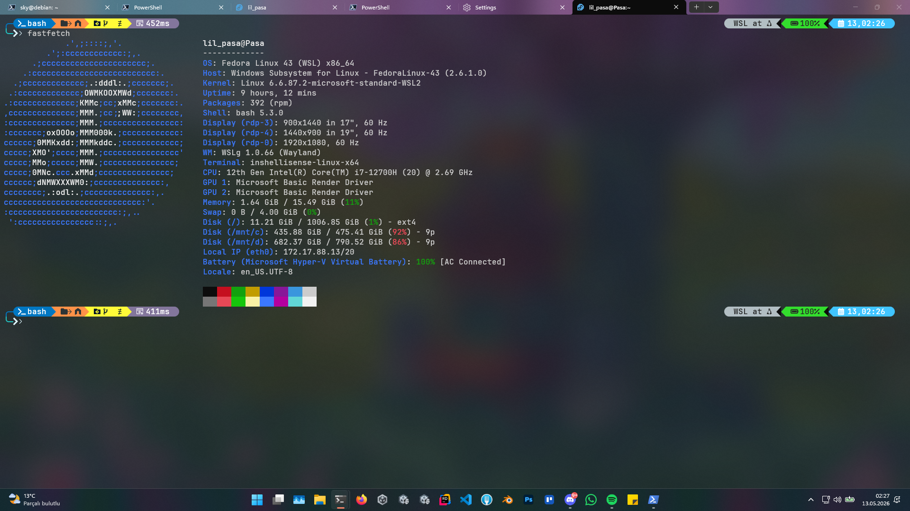

# Kemal's Dotfiles



Cross-platform development environment configs managed with [chezmoi](https://chezmoi.io).

**Supported platforms:**
- 🪟 Windows (PowerShell 7)
- 🍎 macOS (zsh)
- 🐧 Linux (bash) — WSL Fedora, Debian VPS

---

## Quick start (full install)

Install everything on a new machine with one command.

### Windows (PowerShell 7)

Run PowerShell as Administrator:

```powershell
irm https://raw.githubusercontent.com/KBT-0/MyDotfiles/main/scripts/bootstrap-windows.ps1 | iex
```

Then open a new Windows Terminal PowerShell 7 tab and set the profile font to `JetBrainsMono Nerd Font`.

This installs PowerShell 7, Windows Terminal, chezmoi, Oh My Posh, lf + lfcd, and `inshellisense` prediction menus.

### WSL / Linux

```bash
curl -fsSL https://raw.githubusercontent.com/KBT-0/MyDotfiles/main/scripts/bootstrap-wsl.sh | bash
```

This installs base packages, chezmoi, the dotfiles, Oh My Posh, lf + lfcd, and shell prediction menus.

### macOS

```bash
curl -fsSL https://raw.githubusercontent.com/KBT-0/MyDotfiles/main/scripts/bootstrap-macos.sh | bash
```

---

## Partial install (just one tool)

Want the full WSL/Linux setup or just one tool? Run a single script.

### Available tools

| Tool | Description | Install script |
|---|---|---|
| Windows Bootstrap | Full Windows PowerShell setup | `bootstrap-windows.ps1` |
| Bootstrap | Full WSL/Linux setup | `bootstrap-wsl.sh` |
| macOS Bootstrap | Full macOS setup | `bootstrap-macos.sh` |
| Oh My Posh | Prompt theming | `install-ohmyposh.*` |
| lf | Terminal file manager with `lfcd` shell integration | `install-lf.*` |
| Shell prediction menus | Default IDE-style below-prompt suggestions via `inshellisense` | `install-shell-predictions.*` |
| PowerShell predictions | Optional PowerShell-native `PSReadLine` ListView suggestions | `install-psreadline-predictions.ps1` |

### One-line installers

**WSL / Linux:**

```bash
# Full WSL/Linux setup
curl -fsSL https://raw.githubusercontent.com/KBT-0/MyDotfiles/main/scripts/bootstrap-wsl.sh | bash

# Oh My Posh
curl -fsSL https://raw.githubusercontent.com/KBT-0/MyDotfiles/main/scripts/install-ohmyposh.sh | bash

# lf file manager
curl -fsSL https://raw.githubusercontent.com/KBT-0/MyDotfiles/main/scripts/install-lf.sh | bash

# Live shell prediction menus
curl -fsSL https://raw.githubusercontent.com/KBT-0/MyDotfiles/main/scripts/install-shell-predictions.sh | bash
```

**Windows (PowerShell):**

```powershell
# Full Windows PowerShell setup
irm https://raw.githubusercontent.com/KBT-0/MyDotfiles/main/scripts/bootstrap-windows.ps1 | iex

# Oh My Posh
irm https://raw.githubusercontent.com/KBT-0/MyDotfiles/main/scripts/install-ohmyposh.ps1 | iex

# lf file manager
irm https://raw.githubusercontent.com/KBT-0/MyDotfiles/main/scripts/install-lf.ps1 | iex

# Default live prediction menus via inshellisense
irm https://raw.githubusercontent.com/KBT-0/MyDotfiles/main/scripts/install-shell-predictions.ps1 | iex

# Optional PSReadLine ListView predictions instead of inshellisense
irm https://raw.githubusercontent.com/KBT-0/MyDotfiles/main/scripts/install-psreadline-predictions.ps1 | iex
```

**macOS:**

```bash
# Full macOS setup
curl -fsSL https://raw.githubusercontent.com/KBT-0/MyDotfiles/main/scripts/bootstrap-macos.sh | bash
```

---

## What's in this repo

```
dotfiles/
├── home/                          # chezmoi-managed files (auto-applied)
│   ├── dot_zshrc                  # → ~/.zshrc (macOS)
│   ├── dot_bashrc                 # → ~/.bashrc (Linux)
│   ├── dot_config/                # -> ~/.config/
│   │   ├── shell/lfcd.sh
│   │   └── starship.toml
│   └── AppData/                   # Windows-only files
│       └── Local/...
├── scripts/                       # Standalone single-tool installers
│   ├── bootstrap-windows.ps1
│   ├── bootstrap-wsl.sh
│   ├── bootstrap-macos.sh
│   ├── install-ohmyposh.sh
│   ├── install-lf.ps1
│   ├── install-lf.sh
│   ├── install-shell-predictions.ps1
│   ├── install-shell-predictions.sh
│   ├── install-psreadline-predictions.ps1
│   └── ...
└── docs/                          # Setup notes
```

Oh My Posh uses the built-in `atomic` theme on PowerShell, bash, and zsh.

Live below-prompt command suggestions default to `inshellisense` on every supported OS:

- PowerShell: `inshellisense` shell plugin
- Bash/Linux: `inshellisense` shell plugin
- Zsh/macOS: `inshellisense` shell plugin

On Windows, `PSReadLine` ListView is still available as an optional alternative. The prediction installers are intentionally mutually exclusive:

- `install-shell-predictions.ps1` enables `inshellisense` and removes PSReadLine prediction hooks from `$PROFILE`.
- `install-psreadline-predictions.ps1` enables PSReadLine `ListView` and removes the `inshellisense` profile hook.

This only changes profile integration; it does not uninstall the other tool.

---

## Pull just one file with chezmoi

If you already have chezmoi installed and only want one config:

```bash
chezmoi init https://github.com/KBT-0/MyDotfiles.git  # clone without applying
chezmoi cd                                          # go to source dir
# inspect or selectively copy what you want
chezmoi apply ~/.zshrc                              # apply just .zshrc
```

---

## Update an existing install

```bash
chezmoi update          # pull latest + apply
chezmoi diff            # preview what would change
chezmoi apply -v        # apply (verbose)
```

---

## Editing dotfiles

Don't edit `~/.zshrc` directly — edit it through chezmoi:

```bash
chezmoi edit ~/.zshrc       # opens the source file in $EDITOR
chezmoi apply               # applies your changes
chezmoi cd                  # cd into the source repo
git add . && git commit -m "tweak zsh" && git push
```

---

## Sources

- chezmoi: https://github.com/twpayne/chezmoi
- Oh My Posh: https://github.com/JanDeDobbeleer/oh-my-posh
- lf: https://github.com/gokcehan/lf
- inshellisense: https://github.com/microsoft/inshellisense
- PSReadLine: https://github.com/PowerShell/PSReadLine
- Starship: https://github.com/starship/starship
- fzf: https://github.com/junegunn/fzf
- atuin: https://github.com/atuinsh/atuin

---

## License

MIT — feel free to copy anything you find useful.
